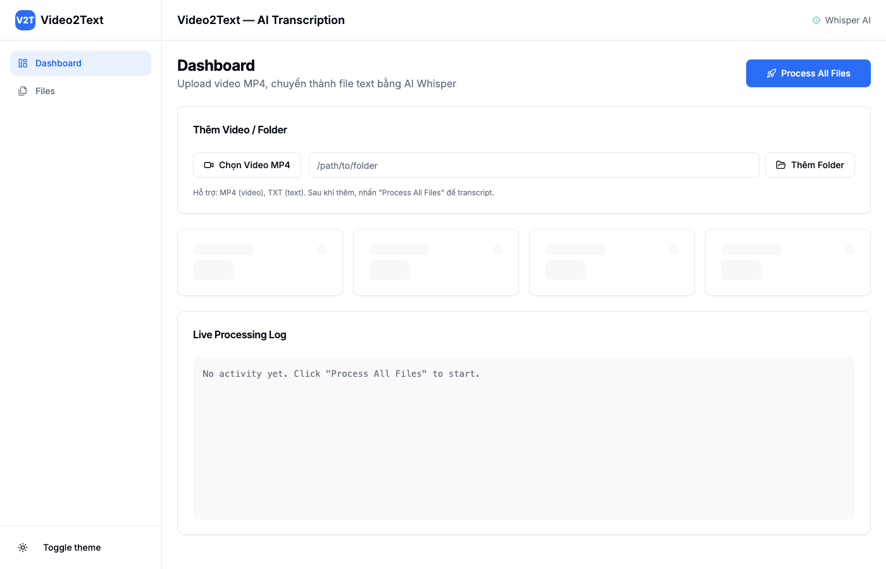
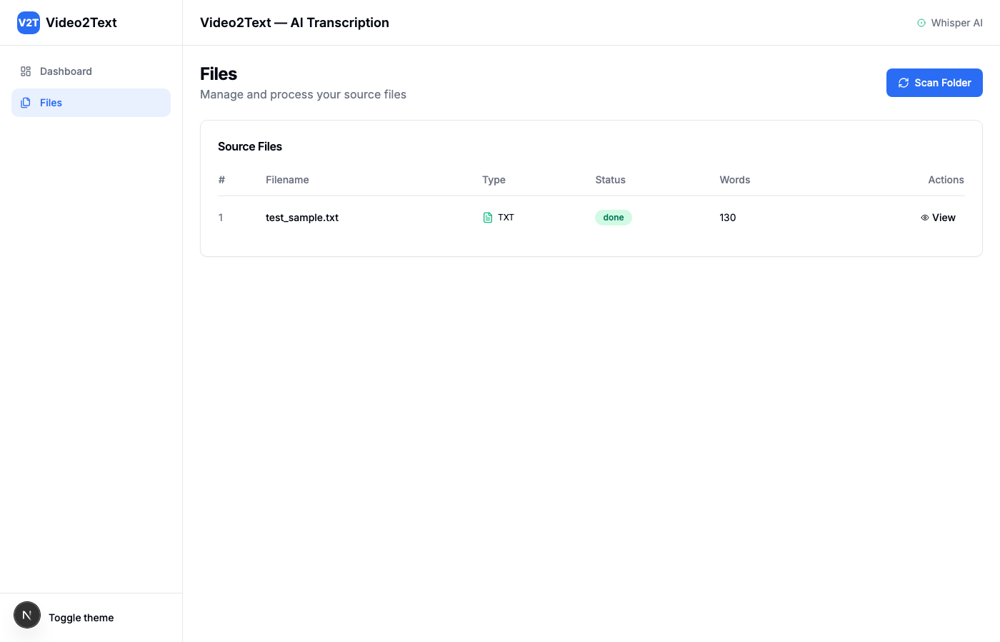

# Video2Text — AI Video Transcription

> Convert video MP4 to text transcripts using **Whisper AI**, with Vietnamese correction dictionary and batch processing.


**Live Demo**: [https://frontend-jet-theta-nvf68h8ewg.vercel.app](https://frontend-jet-theta-nvf68h8ewg.vercel.app)

---

## Screenshots

| Dashboard                                   | Files                               |
| ------------------------------------------- | ----------------------------------- |
|  |  |

---

## Features

- **Video → Text**: Chuyển video MP4 thành file text bằng AI Whisper
- **Vietnamese Corrections**: Tự động sửa lỗi phiên âm tiếng Việt
- **Batch Processing**: Xử lý hàng loạt với progress bar real-time
- **Upload MP4**: Chọn file hoặc folder từ máy tính
- **Live Progress**: Xem % tiến trình qua SSE (Server-Sent Events)
- **Dark/Light Mode**: Giao diện tối/sáng tự động theo hệ thống
- **Download Transcript**: Xem và tải file text đã chuyển đổi

---

## Tech Stack

| Layer         | Technology                                   |
| ------------- | -------------------------------------------- |
| **Frontend**  | Next.js 15, React 19, TailwindCSS, shadcn/ui |
| **Backend**   | FastAPI, Python 3.11+, SQLite                |
| **AI Model**  | faster-whisper (OpenAI Whisper)              |
| **Real-time** | Server-Sent Events (SSE)                     |

---

## Project Structure

```
video2text/
├── backend/            # FastAPI backend
│   ├── main.py         # API server (endpoints)
│   ├── transcribe.py   # Whisper transcription + progress
│   ├── corrections.py  # Vietnamese correction dictionary
│   └── requirements.txt
├── frontend/           # Next.js 15 frontend
│   ├── src/
│   │   ├── app/        # Pages (dashboard, files)
│   │   ├── components/ # UI components (sidebar, header, ui/)
│   │   └── lib/        # Utilities
│   └── package.json
├── .env.example        # Environment config template
├── .github/workflows/  # CI/CD
└── README.md
```

---

## Quick Start

### 1. Clone repo

```bash
git clone https://github.com/qddan/subtitle-generation.git
cd subtitle-generation
```

### 2. Backend Setup

```bash
# Create virtual environment
python3 -m venv venv
source venv/bin/activate   # macOS/Linux
# venv\Scripts\activate    # Windows

# Install dependencies
cd backend
pip install -r requirements.txt

# Install ffmpeg (required for video processing)
# macOS:
brew install ffmpeg
# Ubuntu:
# sudo apt install ffmpeg

# Copy environment config
cp ../.env.example ../.env

# Start server
python -m uvicorn main:app --reload --port 8000
```

### 3. Frontend Setup

```bash
cd frontend
npm install
npm run dev
```

### 4. Open app

Open http://localhost:3000

---

## Usage Guide

### Step 1: Thêm video

- **Chọn file**: Click "Chọn Video MP4" → chọn 1 hoặc nhiều file MP4
- **Thêm folder**: Nhập đường dẫn folder → click "Thêm Folder" (tự động scan cả subfolder)

### Step 2: Chuyển đổi

- Click **"Process All Files"** trên Dashboard
- Xem tiến trình real-time trên progress bar
- Live log hiển thị chi tiết từng bước

### Step 3: Xem kết quả

- Vào trang **Files** để xem danh sách file
- Click **"View"** để đọc transcript
- File text được lưu tại `backend/transcripts/`

### Step 4: Sử dụng transcript

- Copy text từ dialog hoặc lấy file từ thư mục `backend/transcripts/`
- Import vào **NotebookLM**, **Google Docs**, hoặc bất kỳ tool nào

---

## Environment Variables

| Variable          | Default                                       | Description                                               |
| ----------------- | --------------------------------------------- | --------------------------------------------------------- |
| `LOCAL_FOLDER`    | `.`                                           | Folder scan mặc định                                      |
| `OUTPUT_DIR`      | `./transcripts`                               | Thư mục lưu transcript                                    |
| `WHISPER_MODEL`   | `small`                                       | Model Whisper: `tiny`, `base`, `small`, `medium`, `large` |
| `LANGUAGE`        | `vi`                                          | Ngôn ngữ: `vi` (Việt), `en` (English), etc.               |
| `ALLOWED_ORIGINS` | `http://localhost:3000,http://127.0.0.1:3000` | CORS allowed origins (comma-separated)                    |
| `MAX_UPLOAD_SIZE` | `524288000`                                   | Max upload file size in bytes (default 500MB)             |

**Frontend env** (set in Vercel or `.env.local`):

| Variable               | Default                 | Description          |
| ---------------------- | ----------------------- | -------------------- |
| `NEXT_PUBLIC_API_BASE` | `http://localhost:8000` | Backend API base URL |

---

## API Endpoints

| Method | Endpoint               | Description                             |
| ------ | ---------------------- | --------------------------------------- |
| `POST` | `/api/upload-files`    | Upload MP4/TXT files                    |
| `POST` | `/api/add-folder`      | Add files from local folder (recursive) |
| `GET`  | `/api/files`           | List all files                          |
| `GET`  | `/api/stats`           | Get processing stats                    |
| `POST` | `/api/process/{id}`    | Process single file                     |
| `POST` | `/api/process/all`     | Process all pending files               |
| `GET`  | `/api/transcript/{id}` | Get transcript text                     |
| `GET`  | `/api/progress`        | SSE progress stream                     |

---

## Deploy (Free)

### Frontend → Vercel

1. Push code to GitHub
2. Go to [vercel.com](https://vercel.com) → Import repo
3. Set **Root Directory**: `frontend`
4. Add env variable: `NEXT_PUBLIC_API_BASE` = `https://your-backend.onrender.com`
5. Deploy

### Backend → Render

1. Go to [render.com](https://render.com) → New Web Service
2. Connect GitHub repo, set **Root Directory**: `backend`
3. **Build Command**: `pip install -r requirements.txt`
4. **Start Command**: `uvicorn main:app --host 0.0.0.0 --port $PORT`
5. Add env variables:
   - `WHISPER_MODEL` = `tiny` (free tier has limited RAM)
   - `ALLOWED_ORIGINS` = `https://your-frontend.vercel.app`
   - `LANGUAGE` = `vi`

> **Note**: Render free tier spins down after inactivity. First request may take ~30s to wake up. Use `tiny` model on free tier for memory constraints.

### Desktop App (Electron)

```bash
cd electron-app
npm install
npm run dist:mac   # macOS
npm run dist:win   # Windows
npm run dist:linux # Linux
```

---

## Development

```bash
# Option 1: Run both (from root)
npm start

# Option 2: Run separately (from root)
npm run start:backend
npm run start:frontend

# Option 3: Using Make
make start

# Option 4: Manual
cd backend && python -m uvicorn main:app --reload --port 8000
cd frontend && npm run dev

# Run tests
npm test

# Kill running servers
npm run kill
```

---

## Contributing

1. Fork the repo
2. Create a feature branch: `git checkout -b feature/my-feature`
3. Commit changes: `git commit -m "Add my feature"`
4. Push: `git push origin feature/my-feature`
5. Open a Pull Request

---

## License

MIT
